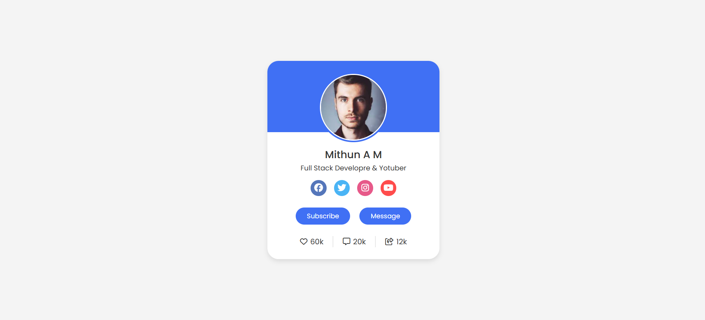
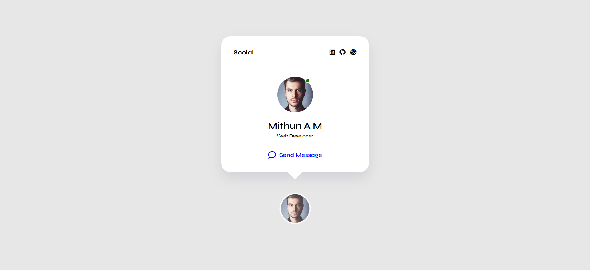

# Card Designs Collection

This repository contains three different card designs implemented with HTML and CSS. Each card demonstrates unique features such as hover effects, animations, and interactive elements.

## Table of Contents

1. Card 1
2. Card 2
3. Card 3
4. Installation 

## Card 1: Hover Animations & Image Effects

Card 1 showcases a collection of scenic images, each paired with descriptive text. It utilizes hover animations to reveal additional information, such as titles and descriptions. When hovered over, the image displays a smooth transition with accompanying details.

### Features:
- Hover effect with smooth transitions
- Reveal hidden text on hover
- Responsive layout for different screen sizes

### Files:
- HTML: `card1.html`
- CSS: `style.css`

### Preview:
 

## Card 2: Profile Card with Social Links

Card 2 presents a profile card design with a circular profile image, user details, social media links, and action buttons. It incorporates Font Awesome icons for social media and includes hover animations for interactive buttons.

### Features:
- Circular profile image with hover effect
- Social media icons with hover effects
- Action buttons for "Subscribe" and "Message"

### Files:
- HTML: `card2.html`
- CSS: `style.css`

### Preview:
 

## Card 3: Social Profile Card with Tooltip

Card 3 provides a social profile card with a unique tooltip that appears when hovering over the card. It displays user details, profile image, and social media links. The tooltip contains additional information and actions like "Send Message."

### Features:
- Profile image with hover scale effect
- Tooltip with social media links
- Responsive design and smooth animation

### Files:
- HTML: `card3.html`
- CSS: `style.css`

### Preview:
 

## Installation

To view these card designs, you can clone or download the repository. Each card has its own `HTML` and `CSS` files. Make sure to place the `style.css` file in the same directory as the corresponding HTML file.

### Steps:

1. Clone this repository or download the files.
2. Open the `card1.html`, `card2.html`, or `card3.html` files in your browser.

